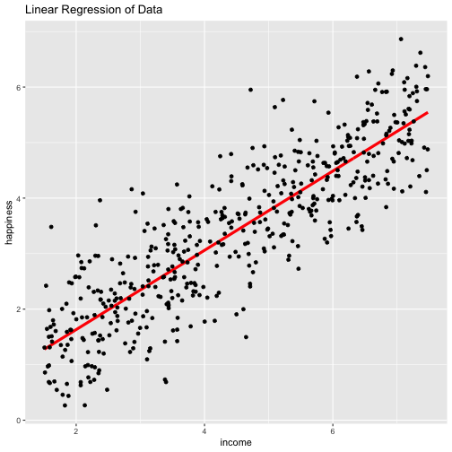

<!-- README.md is generated from README.Rmd. Please edit that file -->


# hw4 - Simple Linear Regression Package

<!-- badges: start -->
[](https://github.com/yunzhang77/hw4/actions)
[](https://codecov.io/gh/yunzhang77/hw4)
<!-- badges: end -->

The goal of this R package is to perform simple linear regression analysis with a single explanatory variable. This package can calculate intercept and slope of the regression model, perform statistical testing on the regression (T-test and F-test), calculate R-squared and adjusted R-squared values, and plot linear regression line. This package also utilizes S3 generic method/function to provide user-friendly display of results. 

## Installation

You can install the development version of hw4 from [GitHub](https://github.com/) with:

``` r
# install.packages("devtools")
devtools::install_github("yunzhang77/hw4")
```

## Quick Guide

After the package is installed on your local R environment, you can perform simple linear regression analysis by calling:
  - `linear_regression()`: which will take three arguments - independent variable name (char), dependent variable name (char), and data (data.frame)
  - `plot_linear_regression()`: which will take two arguments - result from `linear_regression()` and data
  - `print()` can be called to print user-friendly linear regression result that contains regression coefficients
  - `summary()` can be called to print statistical analysis result of the regression model 
  
To better help user to learn how to use this package, two example data sets are included in the package `data_glucose_simple` and `happiness_data`. `data_glucose_simple` can be used to test the functionality of the package and `happiness_data` is a relatively more challening data sets that could be used to validate package performance. See example below on how to use this package. 

## Example

This is a basic example which shows you how to use this package to solve simple linear regression problem:


```r
library(hw4)

# perform regression analysis
result <- linear_regression("income", "happiness", happiness_data)

# print regression coefficient and statistics analysis on the regression model
print(result)
#> Call:
#> linear_regression.default(x_name = "income", y_name = "happiness", 
#>     data = happiness_data)
#> 
#> Coefficients:
#> (Intercept)	 income 
#> 0.2042704 	 0.7138255

summary(result)
#>        Estimate T.statistic   P.value    
#> income  0.71383      38.505 < 2.2e-16 ***
#> ---
#> Signif. codes:  0 '***' 0.001 '**' 0.01 '*' 0.05 '.' 0.1 ' ' 1
#> 
#> R-squared: 0.7493218 	Adjusted R-squared: 0.7488164
#> F-statistic: 1482.632 	p-value: 3.956245e-151
```

You can also generate linear regression plots using `plot_linear_regression()`, for example:



The red line indicates the fitted linear regression line, whereas black dots represent original data points. 

For more specific help on each function, type `?function_name` on the RStudio console. 

## Need Help?

If you encounter a problem/bug, please feel free to report on the GitHub page. :) 
