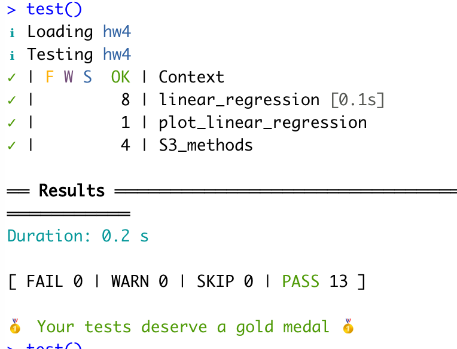

```{r, include = FALSE}
knitr::opts_chunk$set(
  collapse = TRUE,
  comment = "#>"
)
```

Welcome to use this package. The general goal of this package is to perform simple linear regression analysis with a single independent variable. The function of this package is similar to lm(), which it can calculate regression coefficients, determine significance of the regression model by T-test and F-test, calculate R-squared and adjusted R-squared values, and plot linear regression line. This package utilizes S3 method to generate user-friendly result display. 

Please see [GitHub](https://github.com/yunzhang77/hw4) page for instruction on how to install the package. 

Two sample datasets are included in the package to better facilitate user to learn how to use this package: `data_glucose_simple` and `happiness_data`. 

# How to use this package
## Use linear_regression() to perform simple linear regression analysis

```{r}
# load package
library(hw4)
```

It is recommended for users to store linear_regression result to a varible, which will make downstream analysis easier.
```{r}
result <- linear_regression("income", "happiness", happiness_data)
```

This package uses S3 method to provide user-friendly results. To display linear regression coefficients:
```{r}
print(result)
```

To get statistical analysis result of the linear regression:
```{r}
summary(result)
```

## Use plot_linear_regression to generate linear regression plot

After user calls `linear_regression` to perform the initial analysis, user can call `plot_linear_regression` to generate linear regression plot. Linear regression plot uses `ggplot2` to plot both original data points and fitted linear regression line. Original data points are indicated by black dots, whereas fitted linear regression line was represented by the red line. 

To generate linear regression plot:
```{r}
plot_linear_regression(result, happiness_data)
```

# Validation of package performance 

Both efficiency and correctness were tested in this package. lm() was used to compare package performance and unit testing was implemented to make sure user experience is as good as possible. 

## Package efficiency 

`microbenchmark` package was used to determine package efficiency as compared to lm()
```{r, include=FALSE}
library(microbenchmark)
```

```{r}
microbenchmark(lm(formula = happiness ~ income, data = happiness_data), linear_regression("income", "happiness", happiness_data))
```

`microbenchmark` result indicates that this current package is significantly faster than lm() when calculating simple linear regression, possibly due to the simplicity of this package. 

## Package correctness

To test whether both packages generate the same coefficients:
```{r}
lm_result <- lm(formula = happiness ~ income, data = happiness_data)
pkg_result <- linear_regression("income", "happiness", happiness_data)

all.equal(as.vector(lm_result$coefficients), c(pkg_result$intercept, pkg_result$slope))
```

To test whether both packages generate the same R-squared and adjusted R-squared values:
```{r}
all.equal(summary(lm_result)$r.squared, pkg_result$R2)

all.equal(summary(lm_result)$adj.r.squared, pkg_result$R2_adj)
```

To test whether both packages generate the same standard deviation, P-value, and F-statistics:
```{r}
all.equal(summary(lm_result)$coefficients[2,2], pkg_result$std_err)

all.equal(summary(lm_result)$coefficients[2,4], pkg_result$pval)

all.equal(as.vector(summary(lm_result)$fstatistic[1]), pkg_result$f_stat)
```

As mentioned above, unit testing was also implemented in this package. Unit testing has a code coverage of 100% in this package and this package passes all unit test cases. 


